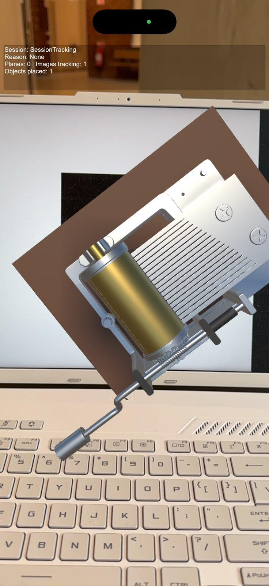
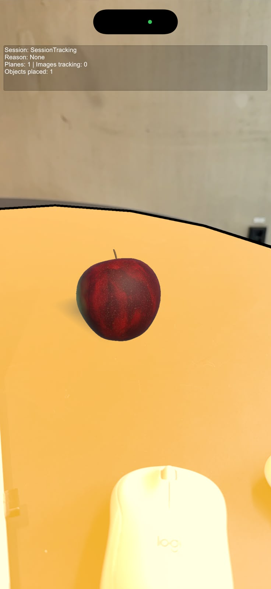

# AR Workshop Assignment

## Introduction

This is a simple AR program including two simple tasks:

1. Use the camera to detect a marker and place an object or trigger something.
2. Use the SLAM algorithm to detect a surface, place an object, or trigger something.

## Get Installation Archive/Package

Turn to Github Actions page to download the .ipa file.

## Versions

- Windows: Windows 11 pro for workstations 25H2
- Unity Editor (full patch): 6000.3.24f1
- AR Foundation: 6.3.5
- Apple ARKit XR Plug-in: 6.3.5
- Input System: 1.20.0
- Xcode used by the successful cloud run:
- iPhone model / iOS: iPhone 16 pro / iOS 27.0
- Sideloadly: v0.60

## Scenes

- PipelineCheck: non-AR installation test.
- ARBaseline: session, origin, camera, and status.
- SurfaceLab: plane detection and sphere placement.
- MarkerLab: reference image and rotating cube.
- CombinedLab: both workshop features.

The assignment deliverable is one app containing both tracking methods.
Use CombinedLab as the only enabled scene for the final iOS build.

## Repository

Use a public GitHub repository. The supplied standard macOS runner has free
compute for public repositories. Releases and their export assets are public.

## Build

1. Enable the intended scene in the active iOS profile.
2. Commit source, then export a fresh Xcode project locally.
3. Package it with Tools/Package-Xcode.ps1.
4. Attach xcode-export.zip to a new GitHub release at the source commit.
5. Manually run iOS unsigned build with that release tag.
6. Download the IPA, then sign/install with Sideloadly on Windows.

## Verification record

| Date | Source commit | Export tag/hash | Actions run | Device test | Result |
|---|---|---|---|---|---|
| 20/09/2026 | Preparation Commit b2ce29c | export-001 / FC72291DE603BF9A2B3D647C93029C8E920BC1276233F7B95B9C2E7B6A91BEC7 | https://github.com/fury471/ARWorkshopAssignment/actions/runs/35476208330 | Not performed | Compilation passed; IPA packaging failed because of incorrect `lipo` argument order. |
| 20/09/2026 | Corrected lipo argument order in workflow commit 398d4b0. | export-001 / FC72291DE603BF9A2B3D647C93029C8E920BC1276233F7B95B9C2E7B6A91BEC7 | https://github.com/fury471/ARWorkshopAssignment/actions/runs/35476942944 | iPhone 16 Pro: installed and launched; test cube visible | Corrected `lipo` argument order; Unsigned IPA generated successfully. |
| 20/09/2026 | Add combined surface and marker AR assignment Commit 6d70928 | export-002 / 2B544BAB1F343E19540A6AA6B5E6BE6BEE4FF9EDA44BA89062EA14A8F5AEA07A | https://github.com/fury471/ARWorkshopAssignment/actions/runs/35516210058 | iPhone 16 Pro: installed through Sideloadly, replaced the previous test app, and launched successfully. | Passed: real camera feed displayed; surface detection and tap-to-place spheres worked; reference image detection displayed a rotating cube. |
| 25/09/2026 | Replace simple models with the apple and music box downloaded online; Add music to the music box Commit 5ccd8ef | export-003 / hash is missing | https://github.com/fury471/ARWorkshopAssignment/actions/runs/36071283116 | iPhone 16 Pro: installed through Sideloadly, replaced the previous test app, and launched successfully. | New models displayed successfully; Music played normally. |

## Assignment evidence

- Surface-based AR: Replaced the sphere with a textured apple prefab. Tap-to-place functionality tested in Unity XR Simulation.
- Image-based AR: Replaced the cube with a music-box model and created materials in Unity. Adjusted its position relative to the reference image.
- Audio behaviour: Configured music to play while the marker content is active, stop when tracking is lost, and restart when tracking returns.
- Device verification: Updated apple and music-box version awaiting iPhone testing.
- Video / screenshots: 

​					 

- Known limitations: Placed apples are not saved between sessions. Placement accuracy depends on tracking quality. Music playback follows the reported tracking state, so stopping may not happen immediately when the image leaves the camera view.

## Provenance

- `TapToPlace` adapts the supplied surface-based workshop code with validation and Editor mouse input. The assigned prefab was changed from a sphere to an apple.
- `SpinObjectOnMarker` reproduces the original marker workshop’s rotation code.
- `MarkerContentController` is an AI-assisted addition that creates content attached to tracked images and controls its visibility using tracking state.
- `MusicBoxAudio` is an AI-assisted addition that starts audio when the content is enabled and stops it when disabled.
- The apple model and supplied texture images were downloaded online and configured as a Unity prefab.
- The music-box model was downloaded online. Its materials were created manually in Unity.
- AI assistance was used for implementation guidance, debugging, and the Windows-to-iPhone build pipeline.

## Asset credits

### Apple

- **Asset:** Apple
- **Creator:** Krayton Gaming
- **Source:** [Apple on Fab](https://www.fab.com/listings/1364a374-2dd0-43a7-b4d1-a6cda5ee09fc)
- **Adaptations:** Configured the supplied textures in a Unity URP material, adjusted scale and placement alignment, and created the `PlacedApple` prefab.
- **Licence:** [Creative Commons Attribution 4.0 International (CC BY 4.0)](https://creativecommons.org/licenses/by/4.0/)

### Music box

- **Asset:** Music Box
- **Source:** [Music Box on CGTrader](https://www.cgtrader.com/free-3d-models/household/other/music-box-c3ee10b7-d509-43ed-9d76-dc42f336c549)
- **Creator:** SpiritStudio
- **Adaptations:** Created silver, brass, plastic, and brown-base materials in Unity; adjusted marker alignment; and added tracking-controlled audio playback.
- **licence:** To be confirmed, but it is free.

### Music

“Music Box Theme” by Kevin MacLeod (incompetech.com).

- **Source:** [Music Box Theme](https://incompetech.com/music/royalty-free/index.html?isrc=USUAN1100417)
- **Licence:** [Creative Commons Attribution 4.0 International (CC BY 4.0)](https://creativecommons.org/licenses/by/4.0/)
- **Use in this project:** Background music for the virtual music box, with playback controlled by marker tracking.
